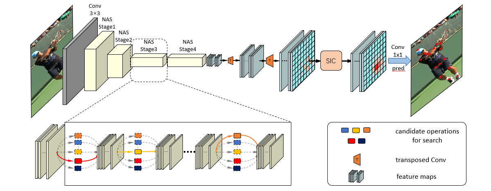
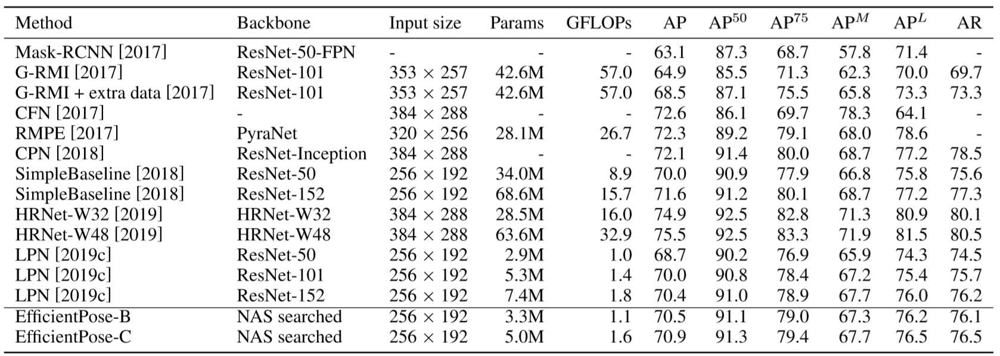

# EfficientPose

The code of the paper [EfficientPose: Efficient Human Pose Estimation with Neural Architecture Search](https://baidu.com)

We propose an efficient framework targeted at human pose estimation including two parts, the efficient backbone and the efficient head. We use NAS(Neural architecture search)  technology to obtain lightweight backbone.  For the efficient head, we slim the transposed convolutions and propose a spatial information correction module to promote the performance of the final prediction.  

## Requirements

- pytorch 1.0.1+
- python 3.5+

## Main Results

#### Results on MPII val

| Arch                | Pretrain | Params | GFLOPs | PCKh@0.5 |
| ------------------- | -------- | ------ | ------ | -------- |
| SimpleBaseline-R50  | Y        | 34.0M  | 12.0   | 88.5     |
| **EfficientPose-A** | N        | 1.3M   | 0.7    | 88.1     |
| SimpleBaseline-R101 | Y        | 52.0M  | 19.1   | 89.1     |
| **EfficientPose-B** | N        | 3.3M   | 1.5    | 89.3     |
| SimpleBaseline-R152 | Y        | 68.6M  | 21.0   | 89.6     |
| **EfficientPose-C** | N        | 5.0M   | 2.0    | 89.5     |

- Flip test is used. Input size is 256x256.
- The [FNA](https://github.com/JaminFong/FNA) previously proposed by our group is used.

#### Results on COCO val2017

| Arch                | Pretrain | GFLOPs | AP    |
| ------------------- | -------- | ------ | ----- |
| **EfficientPose-A** | N        | 0.5    | 0.665 |
| **EfficientPose-B** | N        | 1.1    | 0.711 |
| **EfficientPose-C** | N        | 1.6    | 0.713 |

#### Results on COCO test2017

